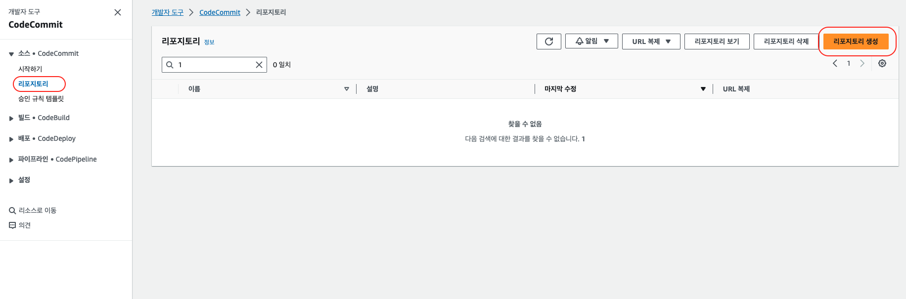
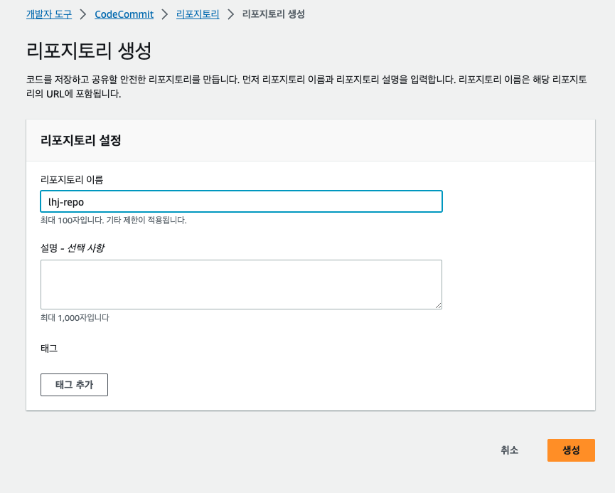
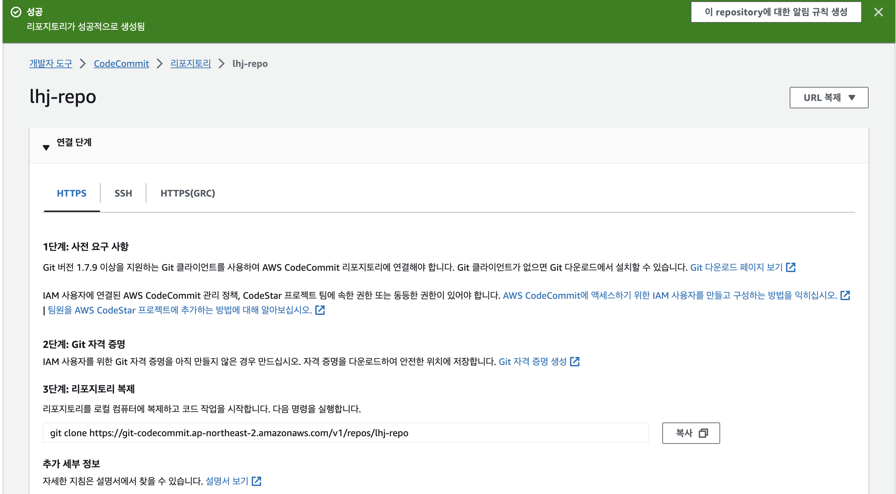
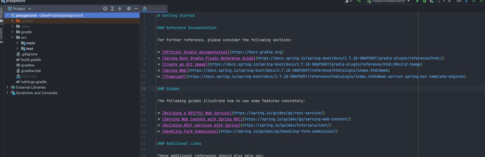
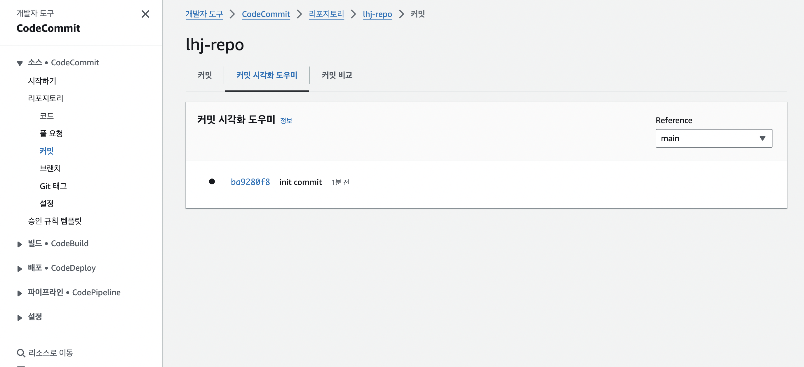

# Code Commit

AWS CodeCommit은 완전히 관리되는 서비스로, 안전하고 확장 가능한 프라이빗 Git 저장소를 제공합니다. 이 서비스를 통해 AWS 클라우드 환경에서 개발자 팀이 협업하여 소스 코드를 효율적으로 저장, 관리, 공유할 수 있습니다.

## 주요 특징

1.보안 및 권한 관리

-   AWS IAM(Identity and Access Management)을 통해 사용자별 액세스 권한을 설정하여 Git 저장소에 대한 접근을 관리합니다. 또한, 데이터는 안전한 네트워크 및 저장소에서 암호화되어 보관됩니다.

2.프라이빗 Git 저장소

-   완전 관리형 프라이빗 Git 저장소를 제공하며, 여러 사용자가 함께 작업하고 소스 코드를 저장, 관리할 수 있습니다.

3.협업 기능

-   여러 명의 개발자가 동시에 작업하며 소스 코드의 변경 내용을 추적하고 관리할 수 있습니다.

4.확장성 및 유연성

-   클라우드 환경에서 쉽게 확장할 수 있으며, 다양한 프로젝트에 유연하게 대응 가능합니다.

5.지속적 통합 및 지속적 배포(CI/CD) 통합

-   AWS CodePipeline, CodeBuild 및 CodeDeploy와 통합하여 CI/CD 파이프라인을 구축할 수 있습니다.

6.통합 및 타사 애플리케이션 지원

-   다양한 통합 기능을 통해 다른 AWS 서비스 및 타사 애플리케이션과의 연계를 가능하게 합니다.

7.버전 및 이력 관리

-   Git의 버전 및 이력 관리 기능을 활용하여 변경 이력을 추적하고 관리할 수 있습니다.

## 순서

1.IAM 에서 사용자 생성 후 Code Commit 권한 부여

-   AWS IAM을 통해 사용자를 생성하고 CodeCommit에 필요한 액세스 권한을 부여합니다.

2.  1에서 생성한 사용자에 대한 Code Commit SSH 퍼블릭키 또는 HTTPS 자격증명 생성  
    
3.  Repository 생성

-   AWS Management Console을 통해 간편하게 새로운 Git 저장소를 생성합니다.  

4.로컬에서 연결하여 확인

-   생성한 저장소를 로컬 환경에 클론하고, 변경사항을 푸시하여 연결이 올바르게 이루어졌는지 확인합니다.  

GitHub과 비교하더라도 AWS CodeCommit은 AWS 서비스와의 강력한 통합 및 보안 기능을 제공하여 특히 AWS 기반의 프로젝트에서 높은 유용성을 발휘할 수 있습니다. 블로그에서 다양한 서비스와의 연계성을 고려할 때, CodeCommit이 효율적인 선택일 수 있습니다.